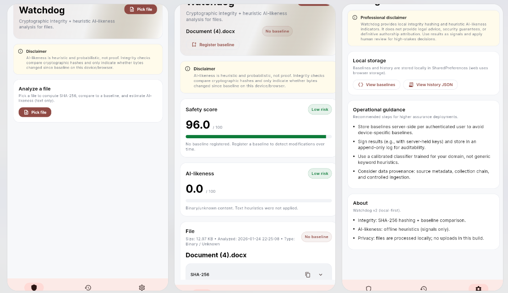
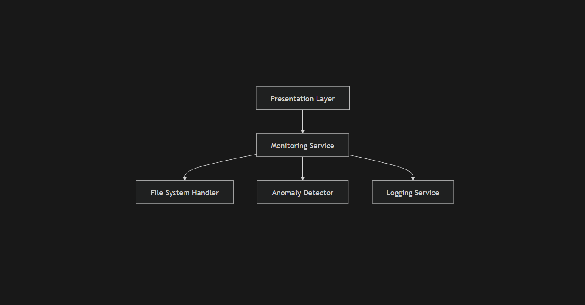
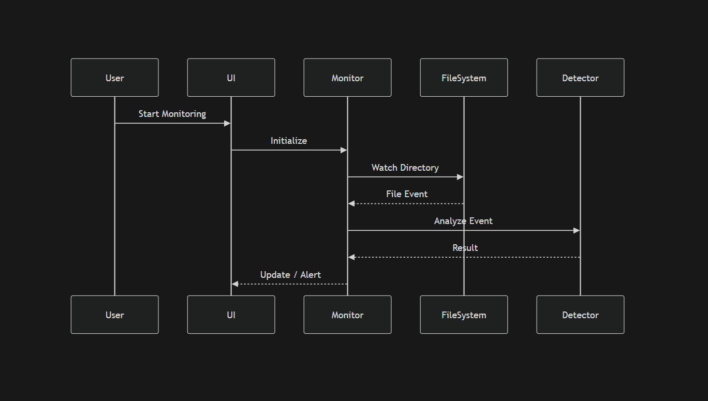
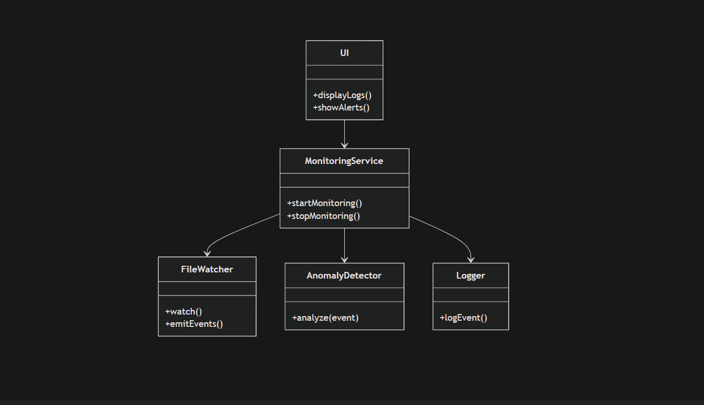

# 🛡️ Watchdog – System Monitoring & File Protection


---

## 📌 Overview

**Watchdog** is a real-time monitoring application designed to **track file changes, detect anomalies, and protect sensitive data**.

It continuously observes system activity and reacts to suspicious behavior — acting as a lightweight **security layer on top of your filesystem**.

---

## ⚡ Elevator Pitch

> A lightweight, cross-platform watchdog that monitors file activity and alerts you to suspicious changes in real time.

---

## 🌐 Live Demo

- Web: *(Add link)*
- Desktop/Mobile: *(Optional builds)*

---

## 🎥 Visuals



- Monitoring dashboard
- File activity logs
- Alert notifications
- Real-time updates

---

## ✨ Key Features

- 👁️ Real-time file monitoring
- 🚨 Suspicious activity detection
- 📊 Logging and diagnostics
- 📁 File integrity tracking
- ⚡ Lightweight & fast
- 🌍 Cross-platform support

---

## 🧱 Tech Stack

- **Framework:** Flutter
- **Language:** Dart
- **Architecture:** Layered (UI + Logic + Services)
- **File Handling:** Local system APIs
- **Optional Extensions:** Notifications, background services

---
## Component Diagram

## Monitoring Flow (Sequence Diagram)

## Class Diagram


# 📖 Case Study

## 🧩 Problem

Modern systems face several risks:

- ❌ Unauthorized file modifications  
- ❌ Malware silently altering files  
- ❌ Lack of real-time visibility into system changes  
- ❌ Difficulty tracking suspicious behavior  

Traditional solutions are often:

- Heavyweight (resource-intensive)  
- Complex to configure  
- Not cross-platform  

---

## 💡 Solution (Watchdog)

Watchdog addresses these issues by:

### 1. Real-Time Monitoring
- Observes file system changes instantly  
- Detects create / modify / delete events  

### 2. Lightweight Detection Engine
- Analyzes events for suspicious patterns  
- Can be extended with rules or heuristics  

### 3. Immediate Feedback
- Alerts users directly in the UI  
- Logs all activity for auditing  

### 4. Cross-Platform Design
- Works across multiple environments using Flutter  

---

## ⚙️ How It Works

1. User selects directory to monitor  
2. File watcher listens for changes  
3. Events are passed to detection engine  
4. System:
   - Logs normal activity  
   - Flags suspicious behavior  
5. UI updates in real time  

---

## 📊 Impact

### Before Watchdog
- Limited visibility  
- Manual monitoring required  
- High risk of unnoticed changes  

### After Watchdog
- ✅ Real-time awareness  
- ✅ Faster incident detection  
- ✅ Improved system security  
- ✅ Clear audit trail  

---

## 📋 Prerequisites

- Flutter SDK (>= 3.x)  
- Dart SDK  
- IDE (VS Code / Android Studio)  

---

## ⚙️ Installation

```bash
# Clone repo
git clone <your-repo-url>

cd watchdog

# Install dependencies
flutter pub get

# Run app
flutter run

